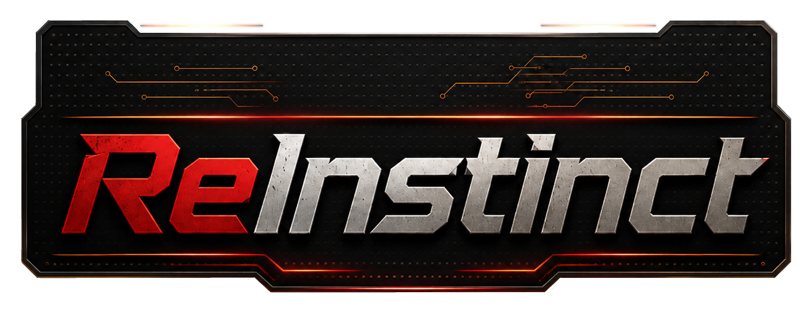
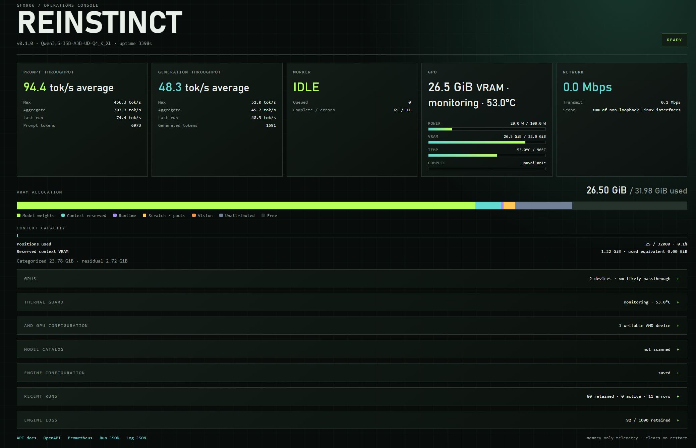
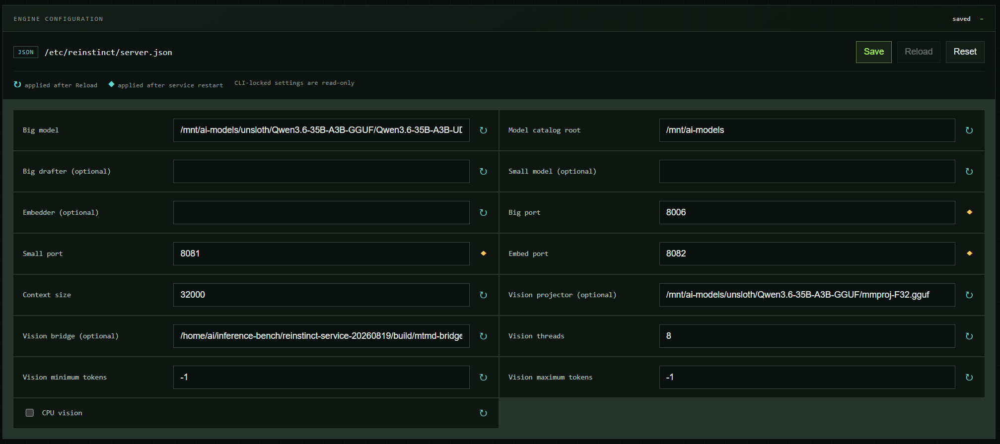
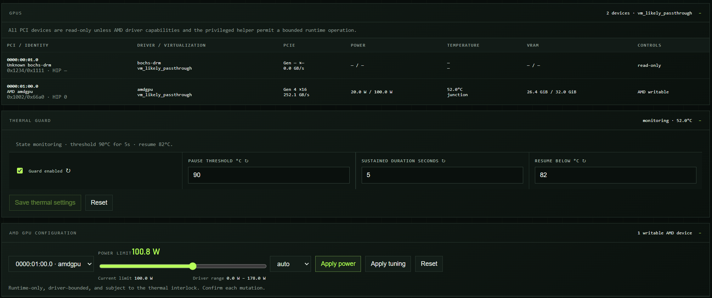
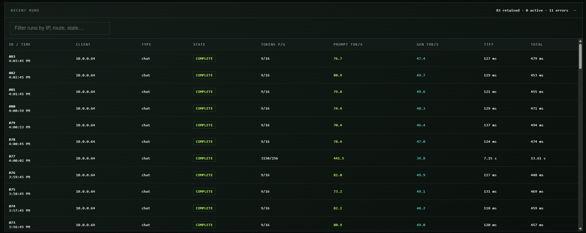
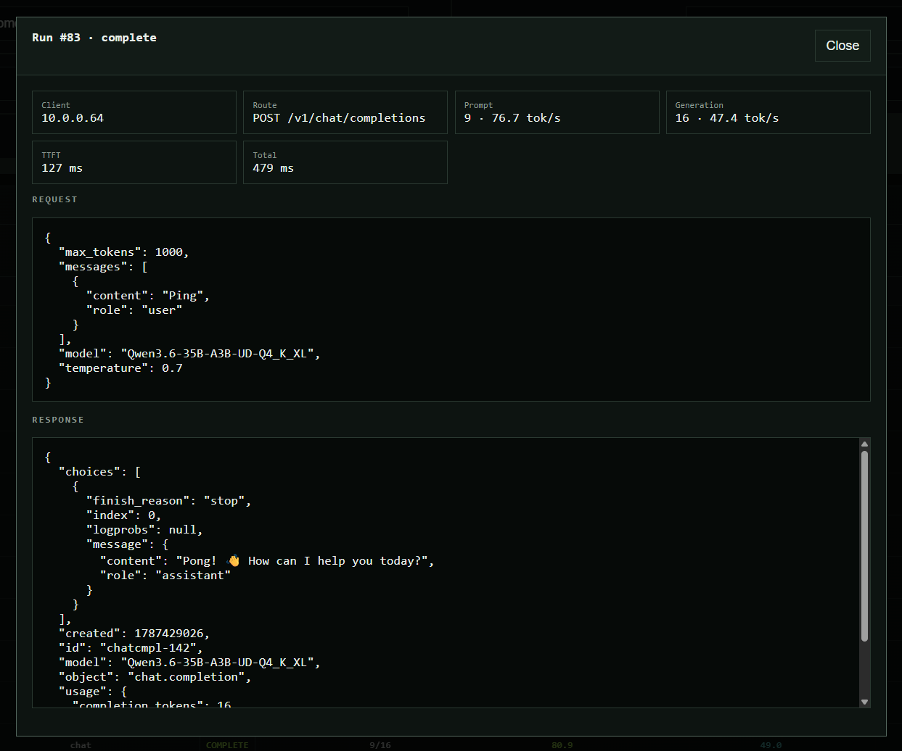
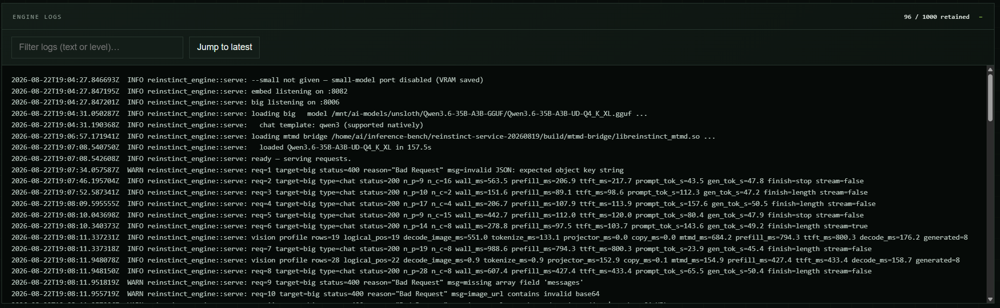

# reinstinct-and-more



This is a personal-use fork of [sixvolts/reinstinct](https://github.com/sixvolts/reinstinct), an experimental Rust + HIP inference engine for AMD gfx906/Vega20 GPUs.

The original project remains the upstream foundation. Its README is preserved here as [README-og.md](README-og.md). This fork is maintained for my own MI50 inference, multimodal, and OpenAI-compatible service use cases, but it is public so other gfx906 owners can inspect it, experiment with it, and reuse ideas that are useful to them.

## What this fork adds

The fork concentrates on practical multimodal serving and operating an MI50 as a reliable local service:

- Qwen3.6 image input through a pinned Furnace/libmtmd bridge, including position-correct M-RoPE and external image-embedding prefill.
- OpenAI-shaped text and image chat requests with streaming responses, bounded request handling, and an OpenAPI 3.1 description.
- A standalone C#/.NET 8 HTTP contract suite under [`tests/api-contract`](tests/api-contract) for black-box API checks.
- A live operations dashboard with GPU/VRAM telemetry, thermal interlocks, persisted JSON configuration, and guarded engine reloads.
- Matched multimodal profiling and performance notes covering projector time, prefill, TTFT, decode, thermal limits, and Furnace comparisons.
- Documentation for the port, deployment, API compatibility roadmap, and validated MI50 service path.

This is not intended to replace upstream or to promise broad model or hardware compatibility. Upstream changes should be brought in deliberately and tested against the fork's multimodal and service behavior.

## MI50 performance snapshot

The MI50 was tested with the automatic GPU performance policy. The active ReInstinct service was restored afterward on its normal port (`8006`), with automatic performance policy confirmed.

| Engine | Prefill | Decode |
| --- | ---: | ---: |
| Original ReInstinct | ~770 tok/s | 77.6 tok/s |
| Our deployed ReInstinct fork | ~785 tok/s | 77.9 tok/s |
| Furnace | 633.9 tok/s | 57.7 tok/s |

In this comparison, the deployed fork was approximately 24% faster than Furnace in prefill and 35% faster in decode. It was only approximately 2% faster than the original ReInstinct build in prefill and effectively tied in decode. Furnace used three repetitions; the direct ReInstinct figures were warm single-run checks, so the small difference between the two ReInstinct builds is approximate rather than statistically significant. See [`docs/PERFORMANCE.md`](docs/PERFORMANCE.md) for the broader matched performance ledger.

## Operations dashboard

The fork includes an embedded operations console for watching a live MI50 service. These screenshots are representative examples from the Qwen3.6 deployment:













## Project map

- [`MANUAL.md`](MANUAL.md) — CLI, server, model, image-input, and deployment reference.
- [`docs/ARCHITECTURE.md`](docs/ARCHITECTURE.md) — runtime and gfx906 design.
- [`docs/MULTIMODAL_PORT.md`](docs/MULTIMODAL_PORT.md) — Furnace/libmtmd integration and validation.
- [`docs/MULTIMODAL_PROGRESS.md`](docs/MULTIMODAL_PROGRESS.md) — current implementation and measured results.
- [`docs/API_COMPATIBILITY_PLAN.md`](docs/API_COMPATIBILITY_PLAN.md) — compatibility scope and acceptance gates.
- [`docs/PERFORMANCE.md`](docs/PERFORMANCE.md) — matched performance ledger.
- [`README-og.md`](README-og.md) — preserved upstream README.

## Getting started

The primary target is a Linux system with an AMD MI50, MI60, or Radeon VII using the gfx906/Vega20 ISA. The project was developed against ROCm 7.1 and requires `hipcc` on `PATH`; model weights and projector files are not included in this repository.

```bash
git clone https://github.com/GaryJS3/reinstinct-and-more.git
cd reinstinct-and-more
git submodule update --init --recursive
cargo build --release
```

The binary is `target/release/reinstinct-engine`. For ordinary text generation:

```bash
./target/release/reinstinct-engine generate-text model.gguf \
  --prompt "Hello from an MI50" --steps 128 --gpu
```

To build the optional Qwen3.6 image bridge, install CMake and the matching HIP/ROCm development tools, then run:

```bash
scripts/build-mtmd-bridge.sh
```

Start the image-capable server with a Qwen3.6 model, its `mmproj*.gguf` projector, and the resulting bridge library:

```bash
./target/release/reinstinct-engine serve \
  --big /path/to/Qwen3.6-35B-A3B-UD-Q4_K_XL.gguf \
  --mmproj /path/to/mmproj-F32.gguf \
  --mtmd-bridge build/mtmd-bridge/libreinstinct_mtmd.so \
  --big-port 8080
```

The v1 image endpoint accepts one local base64 JPEG or PNG data URL. Remote image URLs, multiple images, malformed input, and oversized bodies are rejected. Put the plain HTTP service behind an authenticated TLS reverse proxy before exposing it outside a trusted network. See the [Qwen3.6 image-input section](MANUAL.md#qwen36-image-input-v1) for the request shape and limits.

Run the Rust checks locally with:

```bash
cargo check
cargo test
dotnet run --project tests/api-contract/ReInstinct.ApiContract.csproj -- --base-url http://127.0.0.1:8080
```

The contract suite is HTTP-only and requires a running server for live checks.

## Tech stack

- Rust 2024 edition for the inference engine, CLI, runtime, and HTTP server.
- HIP kernels and runtime loading for AMD gfx906/Vega20 hardware.
- GGUF model files and quantized weights, with Qwen3.5/Qwen3.6 and Gemma support inherited from upstream.
- Pinned Furnace/llama.cpp `libmtmd` components behind a small C++17 C-ABI bridge for image decoding, projector execution, and multimodal embeddings.
- CMake for the optional bridge build.
- C#/.NET 8 with `HttpClient` and `System.Text.Json` for black-box API contract checks.
- Plain HTML/CSS/JavaScript for the embedded operations dashboard.

## Upstream relationship

Keep the original project configured as `upstream` and this repository as `origin`. Merge upstream improvements deliberately, especially around `src/serve`, runtime kernels, and the pinned submodule. The fork's changes are personal-use oriented and may lag or diverge from upstream as the MI50 service needs evolve.

## Acknowledgments

This work builds on sixvolts' original ReInstinct engine, the llama.cpp project, the Furnace/libmtmd multimodal implementation, Unsloth's Dynamic GGUF formats, and the gfx906 community.
